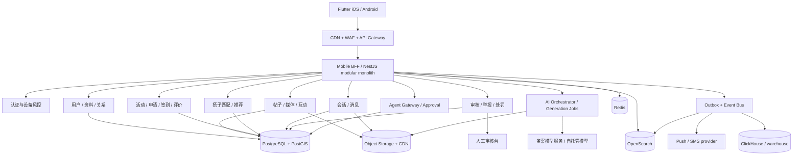

# 系统架构与非功能设计

## 1. 技术原则

首发采用“模块化单体 + 事件驱动边界”，不在冷启动期提前拆十几个微服务。核心交易写入 PostgreSQL，搜索、推荐、聊天和 AI 生成通过异步事件解耦；当单模块出现独立扩容或团队边界时再拆服务。

客户端推荐 Flutter：一套代码覆盖 iOS/Android、适合动画与图片密集 UI，并保留原生实名认证、地图、推送、相机和安全能力桥接。后端推荐 TypeScript + NestJS，领域模块、DTO 与 OpenAPI/JSON Schema 能共享严格类型，便于未来 Agent 调用。

## 2. 总体架构

## 3. 模块职责

| 模块 | 主要职责 | 首发形态 |
|---|---|---|
| Identity | 短信/三方登录、令牌、设备、实名认证结果 | 单体模块 + 外部实名供应商 |
| Profile & Social | 资料、照片、兴趣、关注、拉黑、隐私范围 | 单体模块 |
| Content | 帖子、评论、互动、媒体元数据 | 单体模块 |
| Activity | 活动、名额、审核、候补、邀请、签到、评价 | 核心领域模块 |
| Search | 多实体统一检索、地理过滤、建议词 | OpenSearch 投影 |
| Recommendation | 首页混排、搭子候选、活动候选 | 规则起步，后续独立服务 |
| Messaging | 单聊/群聊、已读、免打扰、静默屏蔽 | 单体写模型 + WebSocket 网关；规模后拆分 |
| Media | 直传签名、转码、内容指纹、AI 标识 | 对象存储 + 异步任务 |
| AI Orchestrator | 封面生成、摘要、审核辅助、提示词版本 | 异步 Job，不阻塞发布编辑流程 |
| Safety | 自动审核、人工案件、举报、处罚、申诉 | 独立管理后台 |
| Agent Gateway | Agent 身份、作用域、计划、试运行、审批、审计 | 与公共 API 同规范，隔离高敏字段 |
| Notification | App Push、站内信、偏好、聚合降噪 | 事件消费者 |

## 4. 读写链路

### 创建活动

1. 客户端先获取媒体上传会话，图片直传对象存储。
2. 无图片时创建 AI 生成任务；任务完成后返回带 AI 标识的媒体资产。
3. 客户端提交草稿，服务端验证人数、时间、地点和媒体归属。
4. 发布命令执行安全策略；低风险直接发布，高风险返回 `approval_required` 或 `pending_review`。
5. 事务内写活动和 Outbox 事件，异步更新搜索、推荐和通知。

### 首页读取

1. BFF 接收推荐/同城模式、粗粒度位置、过滤器和游标。
2. 推荐服务召回活动与动态候选，安全服务先过滤拉黑、处罚和不可见内容。
3. 排序器输出混排列表；每项携带明确 `entity_type` 和 `reason_code`。
4. 客户端按类型渲染不同卡片，曝光事件批量上报用于漏斗与推荐训练。

### 消息

WebSocket 负责实时增量，REST 负责历史、补偿和 Agent 调用。服务端在消息写入前统一检查会话成员、拉黑、静默屏蔽、频控和内容风险；静默屏蔽的策略结果不暴露给对方。

## 5. 数据与基础设施

- PostgreSQL 16 + PostGIS：强一致交易、地理查询、JSONB 扩展字段。
- Redis：验证码、限流、短锁、热会话和推荐缓存，不作为事实主库。
- OpenSearch：活动/帖子/用户/地点统一搜索；索引只存允许被搜索的字段。
- 对象存储 + CDN：原图、缩略图、AI 图片；私有资源使用短期签名 URL。
- Outbox/Event Bus：避免数据库提交成功但消息未发送；首发可用 PostgreSQL Outbox Worker，规模后切 Kafka/Pulsar。
- ClickHouse/数据仓库：曝光、点击、申请、签到、消息等行为分析，不把分析查询打到主库。
- 可选 pgvector：只保存经过数据治理的内容/兴趣向量，不能用向量库绕过可见范围和拉黑规则。

## 6. 地理与隐私

- API 边界接收国内地图 SDK 常用坐标系时显式带 `coordinate_system`，服务层归一化后存储。
- 常住地只存行政区或粗网格；实时精确位置单独授权、短期保存、加密并最小化访问。
- 活动公开页默认显示集合地点的模糊位置；成员获批且临近活动时才可获取精确集合点。
- 地理查询使用 PostGIS `geography(Point, 4326)` 与 GiST 索引。

## 7. 安全基线

- Access Token 15 分钟、旋转 Refresh Token、设备级会话撤销。
- 所有写接口支持 `Idempotency-Key`；关键命令记录操作者、Agent 委托链、请求摘要和前后状态。
- 敏感字段应用层信封加密，密钥由 KMS 托管；备份和日志禁止明文手机号、证件号、精确位置。
- 公开 ID 与内部 UUID 分离，避免顺序枚举。
- WAF、IP/设备/账号三级限流；注册、私信、邀请、关注、AI 生成分别限额。
- 媒体上传使用 MIME/魔数双检、病毒扫描、EXIF 清除、内容指纹和审核状态。
- 拉黑和可见范围由领域服务强制执行，不能仅依赖客户端隐藏。

## 8. 可用性与观测

首发目标可设为核心读 API 99.9%、写 API 99.5%；消息和 AI 生成允许异步降级。所有请求携带 `X-Correlation-Id`，日志、指标、Trace 和审计使用同一关联 ID。

重点指标：API P95/P99、搜索零结果率、推荐延迟、活动库存争抢、消息投递延迟、AI 任务失败率、审核积压、安全事件率。AI 或搜索不可用时，发布仍可保存草稿，首页回退到同城规则流。

## 9. 演进路径

1. **MVP**：单城、模块化单体、PostgreSQL/Redis/对象存储、规则推荐、基础 WebSocket。
2. **增长期**：OpenSearch、独立推荐作业、ClickHouse、审核台、Outbox 接事件总线。
3. **规模期**：拆消息/搜索/推荐/媒体任务；多城市分区；引入 Agent Gateway 和可委托工作流。
4. **生态期**：经审批的个人 Agent、组织者 Agent、场地方 Agent；通过同一 OpenAPI、Webhook 和授权模型协作。

## 10. 中国大陆上线清单

- 完成 App 备案、隐私政策、第三方 SDK 清单、个人信息处理规则和权限最小化。
- UGC/群聊/私信需要账号真实性、内容治理、举报受理和日志留存机制。
- 推荐算法提供关闭个性化或不针对个人特征的选项，并完成适用的算法备案评估。
- 生成式 AI 服务选择已备案/登记能力，客户端显著展示模型名称和相关备案/上线信息；生成图片同时做显式与隐式标识。
- 精确位置和轨迹按敏感个人信息处理，取得单独同意并提供删除/撤回路径。
- 若平台未来直接组织预计 1000 人以上的大型群众性活动，需要另行评估安全许可流程；当前产品人数上限 50 并不触发该人数门槛，但平台责任仍需法律评估。

以上是产品与工程设计基线，不替代正式法律意见。

