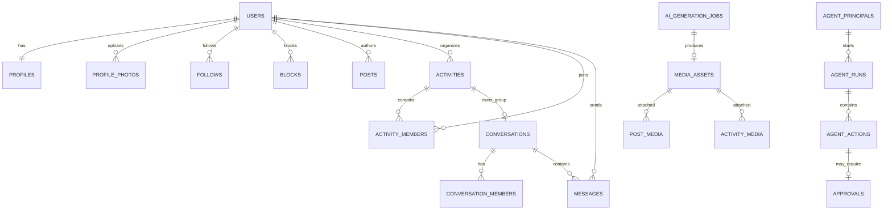

# 数据库模型说明

## 1. 领域分区

| 领域 | 关键表 | 说明 |
|---|---|---|
| 身份与资料 | `users`, `user_identities`, `user_devices`, `profiles`, `profile_photos`, `interests`, `profile_interests`, `privacy_settings` | 内部 UUID 与公开 ID 分离，实名只保留供应商结果和脱敏引用 |
| 关系 | `follows`, `blocks` | 拉黑必须覆盖搜索、推荐、匹配、活动预览与消息 |
| 媒体与内容 | `media_assets`, `posts`, `post_media`, `comments`, `reactions` | 媒体统一记录审核和 AI 标识 |
| 活动 | `activities`, `activity_media`, `activity_tags`, `activity_members`, `activity_invites`, `activity_checkins`, `activity_reviews` | `activity_members` 同时承担申请、候补、成员与履约状态 |
| 匹配 | `match_preferences`, `swipes`, `matches` | 匹配候选是辅助关系入口，不是核心成局事实 |
| 消息 | `conversations`, `conversation_members`, `messages`, `message_receipts` | 群会话可绑定活动；历史使用消息 ID 游标 |
| 通知与安全 | `notifications`, `reports`, `moderation_cases`, `user_penalties` | 举报对象使用类型 + ID，多态引用由应用层和任务校验 |
| AI 与 Agent | `ai_generation_jobs`, `agent_principals`, `agent_grants`, `agent_runs`, `agent_actions`, `approvals` | AI 生成任务与 Agent 行为分开，均可完整审计 |
| 平台可靠性 | `idempotency_keys`, `outbox_events`, `webhook_endpoints`, `webhook_deliveries`, `audit_logs` | 幂等、事件投递和不可抵赖审计 |

## 2. 核心关系

## 3. 重要约束

- 活动人数：`2 <= min_participants <= max_participants <= 50`。
- 活动结束时间晚于开始时间；报名截止不晚于活动开始时间。
- 同一用户对同一活动只有一条成员状态记录。
- 双方匹配 ID 始终按 UUID 排序存储，避免 A-B 与 B-A 两条重复记录。
- 点赞等 reaction 通过唯一键避免重复；计数列只作缓存，事实仍来自关系表或事件流。
- 公开用户名、手机号散列、实名供应商引用、幂等键均建立唯一索引。
- `media_assets.ai_generated = true` 时必须有生成任务和标识元数据；生产环境通过应用服务/触发器加强约束。
- 活动群中只有已批准/已加入的活动成员可成为会话成员。

## 4. 热点与索引

- `activities.location` 使用 GiST；公开活动按城市、状态、开始时间建立部分索引。
- 首页混排不直接在主库做跨表深分页；由搜索/推荐投影生成统一游标。
- 消息按 `(conversation_id, id DESC)` 读取；规模期按 `conversation_id` 哈希分区。
- `activity_members(activity_id, status, created_at)` 支持审核与候补；状态变更需行锁或原子条件更新防止超卖。
- `blocks` 同时建立阻止者与被阻止者方向索引，推荐召回后做集合过滤。
- Outbox 以 `occurred_at` + `published_at IS NULL` 部分索引拉取。

## 5. 数据保留建议

| 数据 | 默认策略 |
|---|---|
| 验证码/IP 风控明细 | 达成安全目的后的最短期限，分级脱敏 |
| 精确实时位置 | 原则上不持久化；确需保存则短期 TTL、加密、单独同意 |
| 活动集合点 | 活动结束后将精确点降级为区域信息，除非安全/争议留存需要 |
| 聊天内容 | 按用户协议、治理和争议处理需要设期限，并支持依法删除/导出 |
| 身份认证材料 | 优先由合规供应商保管；平台只存结果、时间和脱敏引用 |
| AI 提示与生成物 | 记录模型/版本/标识/确认人；提示词先做个人信息清理 |
| 审计日志 | 关键高风险行为使用追加写存储和独立权限，按合规周期留存 |

完整可执行基线见 [`database/schema.sql`](../database/schema.sql)。字段注释、加密列和保留期限仍需在正式数据分级后补充。

