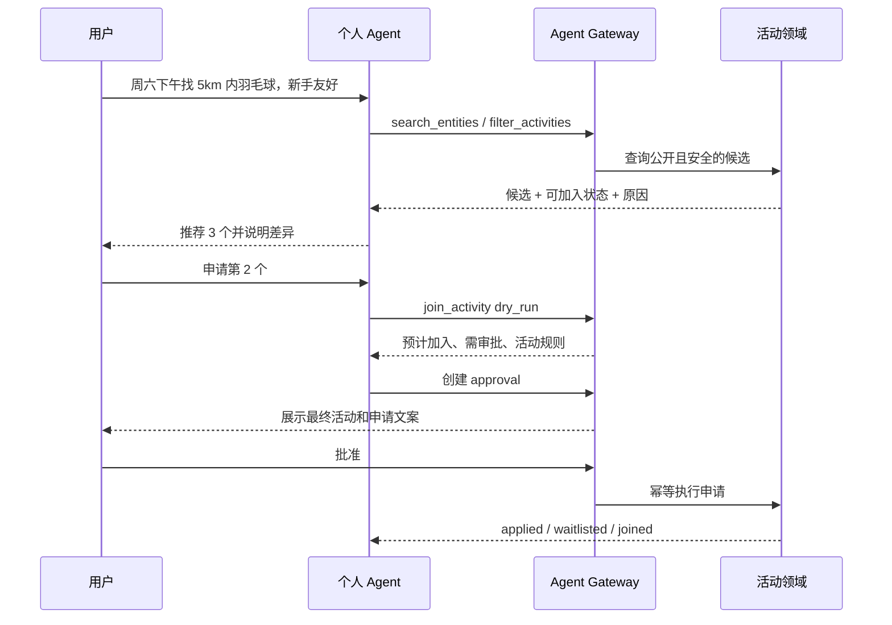

# Agent 化设计

## 1. 目标

未来的 Agent 不应通过“模拟点屏幕”操作 App，而应使用与移动端同源、带类型和策略信息的 API。每个 Agent 都是独立主体，有所有者、授权范围、有效期、资源约束、幂等键、审批和审计链。

## 2. Agent 身份模型

- `principal`：Agent 自身身份，可为第一方助手、个人 Agent、组织者 Agent、场地方 Agent 或合作服务。
- `on_behalf_of`：当前代表的用户；不能只凭 Agent API Key 推断。
- `grant`：用户授予的 scopes、有效期、活动/城市/人数/金额限制。
- `run`：一个明确目标，例如“找周六下午 5km 内的羽毛球活动并申请一个”。
- `action`：目标中的原子步骤，带 `operation_id`、输入摘要、风险级别、dry-run 和结果。
- `approval`：高风险动作的人类确认，展示结构化 diff，审批后输入不可被 Agent 偷换。

## 3. 风险与审批矩阵

| 动作 | 默认风险 | 默认审批 |
|---|---|---|
| 搜索、筛选、查看公开活动 | 低 | 不需要 |
| 阅读本人资料、草拟帖子/活动、生成封面 | 低/中 | 不需要，但不自动发布 |
| 修改非敏感偏好、关注用户 | 中 | 可由短期授权免审批 |
| 发布动态/活动、申请加入活动 | 高 | 首次或超出预设策略时审批 |
| 邀请他人、发送首次私信、变更集合地点 | 高 | 需要审批或明确的细粒度授权 |
| 代表用户连续发送消息 | 高 | 限频；会话级授权；可随时暂停 |
| 拉黑、举报、删除内容、取消活动 | 高 | 需要明确确认；安全紧急场景可先保护后复核 |
| 实名、读取精确位置/电话、账户注销 | 关键 | 必须本人强确认，通常不向第三方 Agent 开放 |
| 支付、退款、收费变更 | 关键 | 每笔审批 + 金额上限 + 二次认证 |

## 4. Agent 友好接口约定

1. **稳定 operationId**：工具名与 OpenAPI `operationId` 一致。
2. **严格 Schema**：枚举、单位、时间、坐标系、最大长度都有机器可读约束。
3. **先预览后执行**：任何高风险命令均支持 `dry_run`，返回 `proposed_changes`、`policy_findings`、`approval_required`。
4. **幂等**：每个动作使用独立 `Idempotency-Key`，重复执行返回同一资源或结果。
5. **能力发现**：资源返回 `capabilities`，Agent 只能从允许动作中选择。
6. **可恢复异步**：AI、审核、导出使用 Job 状态机和 Webhook，不要求 Agent 长连接轮询。
7. **可解释错误**：错误指出字段、策略、是否可重试和可选下一步，不返回含糊的 400。
8. **可验证副作用**：命令成功后返回资源版本、事件 ID 和审计引用。

## 5. 示例工作流

### 找活动并申请

### 发布无图活动

Agent 先创建活动草稿，再创建 AI 封面任务。任务成功后只把预览提交给用户；用户确认 AI 图片和最终文案后，发布动作才能执行。确认记录绑定生成 job、媒体 hash 和活动版本，避免确认后替换图片。

## 6. 数据边界

默认禁止 Agent 获取：身份证明原文、手机号、精确常住位置、未获批活动的精确集合点、被静默屏蔽状态、其他用户不可见资料、完整设备指纹和内部风控分。

对话摘要必须在本地授权范围内生成；第三方 Agent 不得将私聊用于跨用户训练。所有 Agent 日志先脱敏，提示词中不得直接拼接高敏字段。

## 7. 防失控措施

- 每次 run 限制最大动作数、最长时间、最大消息数和最大 AI 费用。
- Agent 不能自行扩大 scope、批准自己的 action 或关闭审计。
- 发布、删除、付款等动作使用服务端不可变审批快照。
- 用户可一键暂停 Agent、撤销 grant 和撤销设备会话。
- 高频关注/邀请/私信触发熔断；异常 Agent 可按 principal 单独吊销，不影响用户账号。
- Agent 输出永远视为不可信输入，经过同一内容审核和权限校验。

## 8. 推进顺序

1. 先把 App 内所有动作变为严格、幂等、有 operationId 的 API。
2. 上线第一方只读助手：搜索、筛选、总结活动差异。
3. 增加草稿型能力：起草活动、生成封面、准备申请文案。
4. 引入 HITL 后开放发布、申请和消息。
5. 最后开放场地方/组织者 Agent 和支付相关能力。

