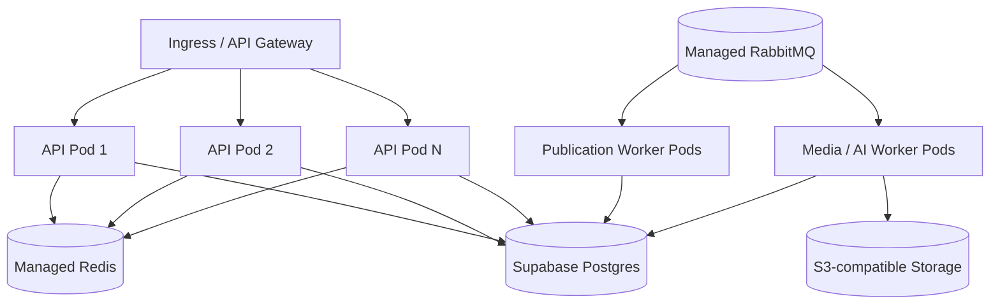

# Vercel、Supabase 与多 Pod 部署

## 推荐边界

- **Expo / EAS**：构建和发布 iOS、Android App。
- **Vercel**：品牌官网、运营后台、管理控制台。长连接 API 和持续消费 MQ 的 Worker 不放进短生命周期 Serverless Function。
- **Supabase**：托管 PostgreSQL/PostGIS，后续接 Supabase Auth；对象存储通过当前 S3 适配层替换 MinIO。
- **Kubernetes 或托管应用平台**：运行无状态 API Pod 和独立 Worker Pod；使用 Buildpacks/Nixpacks 从源码生成 OCI 交付物，不维护手写镜像构建文件。
- **托管 Redis / RabbitMQ**：缓存、限流、实时状态、异步任务和死信处理。

## 多 Pod 已做的准备

1. API 不保存进程内业务状态；会话、幂等键、任务和发布状态都在 PostgreSQL/Redis。
2. Outbox Publisher 使用 `FOR UPDATE SKIP LOCKED`，多个 Worker Pod 不会领取同一条待发送记录。
3. RabbitMQ 使用持久化 Exchange/Queue/Message，发布端等待 Broker Confirm 后才标记 Outbox 已发送。
4. Consumer 在业务事务开始时以 `(consumer_name, event_id)` 原子认领事件；重复投递不会重复生成图片或重复发布。
5. 失败任务进入带 TTL 的 retry queue，超过次数进入 dead queue，不阻塞主发布队列。
6. 创建帖子支持 `Idempotency-Key`，移动网络重试不会生成重复资源。
7. `/v1/system/health` 检查 PostgreSQL、Redis、RabbitMQ、对象存储；`/v1/metrics` 输出 Prometheus 指标。
8. 每个请求返回 `x-correlation-id`，API/Worker 输出结构化 JSON 日志。

本地开发使用 OrbStack 原生 Ubuntu machine 和 systemd 服务，与生产 Pod 的编排方式解耦。生产发布建议由 CI 运行 Buildpacks，开发电脑不需要本地镜像构建链路。

## 建议的 Pod 拆分

建议初始请求/限制：API `2 replicas × 500m CPU × 512Mi`，Worker `2 replicas × 1 CPU × 1Gi`，按队列深度做 HPA。模型推理通过外部 Model Gateway；不要把大模型权重和业务 API 放在同一 Pod。

## Supabase 迁移顺序

1. 在 Supabase 数据库启用 `pgcrypto` 与 `postgis`，运行 schema 和 runtime migration。
2. 把 `DATABASE_URL` 指向 Supabase 的连接池地址；事务型 Worker 优先使用 session mode 或直连地址。
3. 新增 Supabase JWT/JWKS 鉴权适配器，把 `auth.users.id` 映射到 `app.user_identities`，不要直接让客户端写业务 schema。
4. 将 MinIO 客户端替换为同一 `ObjectStorage` 接口下的 Supabase Storage/S3 实现，并保留隔离区、审核状态和短期签名 URL。
5. 用 Row Level Security 作为纵深防御；主要授权仍在 API 层完成，Agent 调用使用短期、细粒度委托凭证。

## Agent 与模型部署

- `/v1/agent/manifest` 暴露能力、审批策略和审计要求。
- `/v1/agent/tools` 返回类型化工具定义；完整定义位于 `activity-social-app-product/api/agent-tools.json`。
- Agent 的 `publish / send_message / invite / delete / payment` 必须经过用户确认。
- 模型只生成活动草案、封面、摘要和审核建议；最终权限、配额、幂等、内容状态由确定性业务 API 控制。
- 模型调用记录 prompt hash、模型名、延迟、状态和 correlation id；生成媒体记录 provenance 与 AI 标签。
