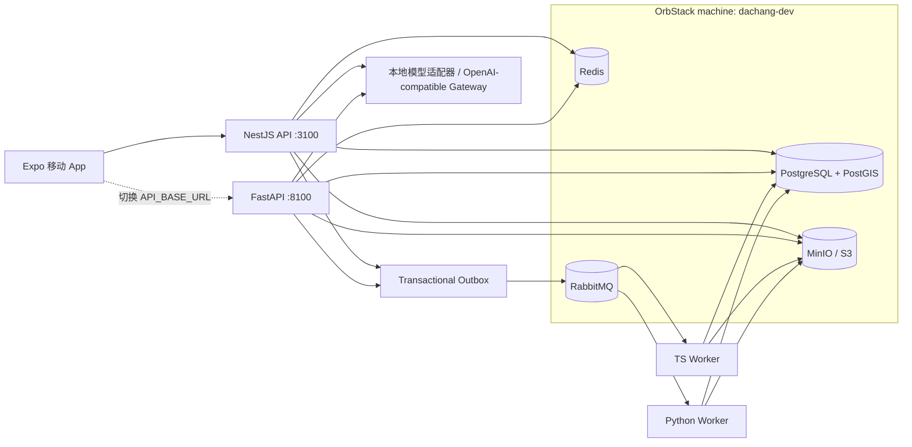

# 本地运行与测试

## 服务关系



两套 API 共用一个数据库，但使用独立的 RabbitMQ 路由键与队列，便于并行做接口等价性测试。生产环境二选一即可；推荐 TypeScript 作为业务主后端，Python 保留给模型编排、离线任务或快速实验。

## OrbStack 原生基础设施

```bash
npm run infra:up
npm run infra:status
```

首次运行会创建 `dachang-dev` Ubuntu 24.04 machine，并在其中以 systemd 服务直接运行 PostgreSQL/PostGIS、Redis、RabbitMQ 和 MinIO。初始化数据库时依次执行：

1. `activity-social-app-product/database/schema.sql`
2. `infra/db/002-runtime.sql`
3. `infra/db/003-seed.sql`

如果需要清空本地数据重新初始化：

```bash
npm run infra:reset
```

该命令会清空 OrbStack machine 内的本地数据库、Redis、RabbitMQ 队列和 MinIO 对象，只用于开发数据。machine 自身会保留，因此后续启动不需要重复安装系统包。

停止全部基础设施并关闭 machine：

```bash
npm run infra:down
```

## 环境变量

OrbStack 会把 machine 内监听的端口自动转发到 macOS 的 `127.0.0.1`。根目录启动脚本会自动注入标准端口变量，并依次加载存在的 `.env`、`.env.local`；需要连接远端模型或替换基础设施时，可复制 `.env.example` 后修改。主要变量：

- `DATABASE_URL`
- `REDIS_URL`
- `RABBITMQ_URL`
- `S3_ENDPOINT / S3_PORT / S3_ACCESS_KEY / S3_SECRET_KEY / S3_BUCKET`
- `MODEL_PROVIDER / MODEL_BASE_URL / MODEL_API_KEY / MODEL_NAME`
- `EXPO_PUBLIC_API_BASE_URL`
- `AUTH_MODE / SUPABASE_URL / SUPABASE_JWKS_URL / SUPABASE_JWT_AUDIENCE`
- `EXPO_PUBLIC_AUTH_MODE / EXPO_PUBLIC_SUPABASE_URL / EXPO_PUBLIC_SUPABASE_PUBLISHABLE_KEY`

`AUTH_MODE=hybrid` 适合联调：没有 Supabase Session 时移动端继续使用演示 Token，有 Session 后自动把 access token 交给业务 API。生产环境必须使用 `AUTH_MODE=supabase`。Publishable key 可以进入 App，secret key 和数据库密码不可以。

`MODEL_BASE_URL` 为空时使用确定性的本地模型适配器，保证离线开发和 CI 可重复。配置后会调用 OpenAI-compatible `/chat/completions`，业务层不依赖具体模型厂商。

## 测试层次

```bash
# 静态检查与单元测试
npm run typecheck
npm run test:unit
npm run test:python

# 两套 API 与所有依赖已启动后
npm run test:e2e

# 上述全部检查
npm run test:all
```

移动端布局使用真实安全区、窗口尺寸和系统字体缩放计算，不按具体手机型号写死高度。Web E2E 会覆盖 320px 小屏、标准 iPhone 和大屏 Android 三种视口；安装 Development Build 后可运行原生冒烟测试：

```bash
cd apps/mobile
npx eas-cli@latest build --platform android --profile development
maestro test .maestro/smoke.yaml
```

真机联调时仍需把 `EXPO_PUBLIC_API_BASE_URL` 指向电脑的局域网 IP；手机上的 `127.0.0.1` 是手机自身。

`tests/e2e/specs/async-publication.spec.ts` 会真实创建帖子、发 Outbox、经 RabbitMQ 消费、向 MinIO 写 AI SVG，再轮询 PostgreSQL 中的发布状态。它不是 mock 测试。

## 常见问题

- 本机统一使用 `127.0.0.1`，不要使用 `localhost`；部分公司网络会重写 `localhost` DNS。
- 中间件统一使用 OrbStack 转发的 `127.0.0.1` 标准端口；不要把 machine 的临时 IP 写进配置。
- 真机上的 `127.0.0.1` 指手机自身，需要使用电脑局域网 IP。
- 更换数据库 SQL 后，已有数据库不会自动重新跑初始化脚本；本地可执行 `npm run infra:reset`。
- 发布停在 `pending_review` 时，先确认对应 Worker 正在运行，再看 RabbitMQ 的 retry/dead 队列。
- 对象上传先进入 `quarantine/`，调用 complete 后才由 Worker 完成检查并标为 `approved`。
