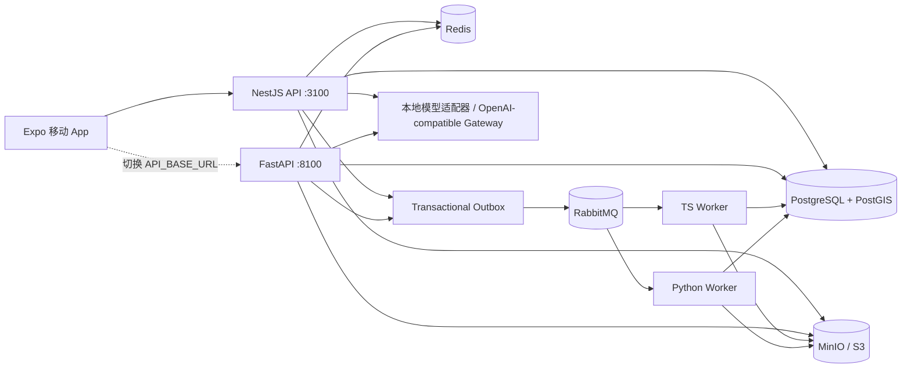

# 本地运行与测试

## 服务关系



两套 API 共用一个数据库，但使用独立的 RabbitMQ 路由键与队列，便于并行做接口等价性测试。生产环境二选一即可；推荐 TypeScript 作为业务主后端，Python 保留给模型编排、离线任务或快速实验。

## 一键基础设施

```bash
npm run infra:up
docker compose ps
```

首次创建数据卷会依次执行：

1. `activity-social-app-product/database/schema.sql`
2. `infra/db/002-runtime.sql`
3. `infra/db/003-seed.sql`

如果需要清空本地数据重新初始化：

```bash
npm run infra:reset
```

该命令会删除本仓库 Docker Compose 创建的数据卷，只用于本地开发数据。

## 环境变量

默认值已经能在本机直接运行。需要连接远端模型或替换基础设施时，复制 `.env.example` 为 `.env` 并修改。主要变量：

- `DATABASE_URL`
- `REDIS_URL`
- `RABBITMQ_URL`
- `S3_ENDPOINT / S3_PORT / S3_ACCESS_KEY / S3_SECRET_KEY / S3_BUCKET`
- `MODEL_PROVIDER / MODEL_BASE_URL / MODEL_API_KEY / MODEL_NAME`
- `EXPO_PUBLIC_API_BASE_URL`

`MODEL_BASE_URL` 为空时使用确定性的本地模型适配器，保证离线开发和 CI 可重复。配置后会调用 OpenAI-compatible `/chat/completions`，业务层不依赖具体模型厂商。

## 测试层次

```bash
# 静态检查与单元测试
npm run typecheck
npm run test:unit
npm run test:python

# 两套 API 与所有依赖已启动后
npm run test:e2e

# 上述全部检查
npm run test:all
```

`tests/e2e/specs/async-publication.spec.ts` 会真实创建帖子、发 Outbox、经 RabbitMQ 消费、向 MinIO 写 AI SVG，再轮询 PostgreSQL 中的发布状态。它不是 mock 测试。

## 常见问题

- 本机统一使用 `127.0.0.1`，不要使用 `localhost`；部分公司网络会重写 `localhost` DNS。
- 真机上的 `127.0.0.1` 指手机自身，需要使用电脑局域网 IP。
- 更换数据库 SQL 后，已有数据卷不会自动重新跑初始化脚本；本地可执行 `npm run infra:reset`。
- 发布停在 `pending_review` 时，先确认对应 Worker 正在运行，再看 RabbitMQ 的 retry/dead 队列。
- 对象上传先进入 `quarantine/`，调用 complete 后才由 Worker 完成检查并标为 `approved`。
